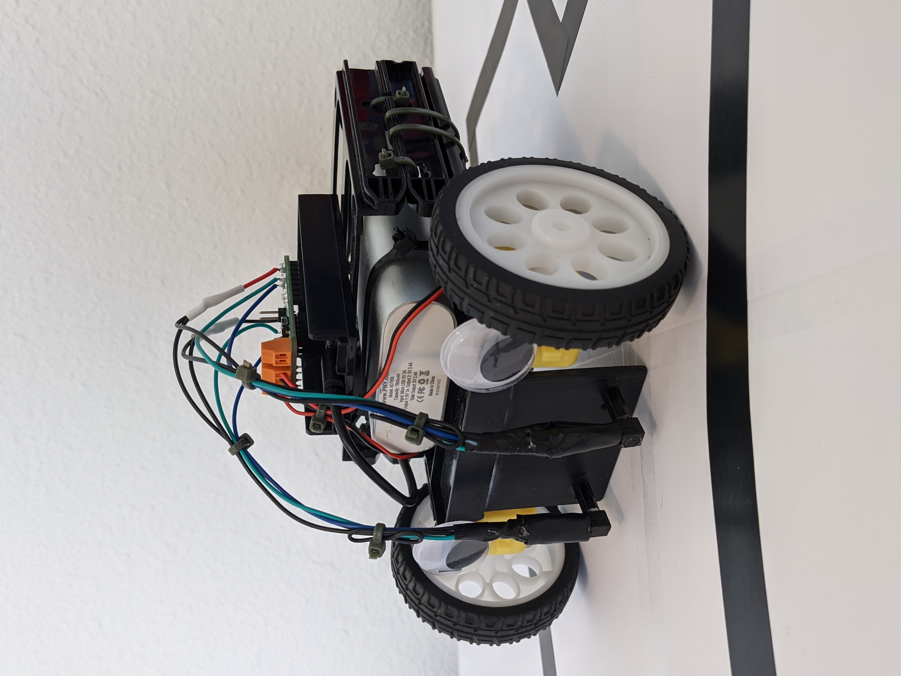

# Line-Following-Robot (LFR)

# External Hardware

-	**1x Silicon Labs BGM220 Explorer Kit board** - This board from Silicon Labs is designed for rapid prototyping and concept creation of IoT applications. The features I utilized from this board were the USB interface, user-LED and button, and mikroBUS socket.

-	**1x MikroElektronica DC Motor 17 Click board** - This board is a compact add-on board that contains a brushed DC motor driver. It is used to control the direction of rotation of the two TT DC Gearbox Motors that are connected to its motor terminals. Additionally, the power, ground, IR LED, and IR phototransistor sensors of the two Miniature Reflective Optical Sensors are soldered to appropriate pins on the board. The board itself is plugged into the mikroBUS socket on the mikrocontroller. The board is supported by a mikroSDK compliant library, which included functions that are meant to simplify software development. However, under the advice of Dr. Sergei, I chose to write my own motor-control functions for this project.

-	**2x Miniature Reflective Optical  IR Sensors** - These miniature reflective IR sensors each contain an IR LED and an IR phototransistor. When the robot is running, the IR LED is turned on and the IR phototransistor is taking in readings based on whether or not it is detecting the reflection of the IR LED. If the IR phototransistor is detecting the reflection of the IR LED (i.e., the sensor is over a white surface), the IR phototransistor reads a value of 0. If the IR phototransistor is not detecting the reflection of the IR LED (i.e., the sensor is over a black surface), the IR phototransistor reads a value of 1. The robot motors are controlled based on these readings.

-	**2x TT DC Gearbox Motors** - Enable robot movement. Plugged in to the DC motor terminals on the DC Motor 17 Click board.

-	**2x Wheels for TT DC Gearbox Motors** - Attached to the 2 TT DC Gearbox motors. 

-	**1x swivel caster wheel** - To support the back-half of the robot.

-	**2x 11mm brass standoffs** - Glued to the IR sensors to allow their location to be moved easily between several holes on the front of the robot.

-	**1x 470 ohm resistor** - To provide resistance for the IR LED.

-	**1x 10K ohm resistor** - To provide resistance for the IR phototransistor output pullup.

-	**Misc. strands of 22-gauge wire** - To connect the IR sensors to the corresponding MikroElektronica DC Motor 17 Click board pins.

-	**1x 7800 mAh portable battery** - To power the mikrocontroller.

-	**1x USB to micro-USB cable** - To connect the portable battery to the mikrocontroller.

-	**Misc. Heat-shrink** - To protect wire connections.

-	**Misc. desktop computer case parts** - To construct the robot chassis. The main platform that the motors are attached to was the bottom air-intake's dust filter. The battery pack is in a cage made from two drive bays. 

-	**Misc. Zip-ties** - To hold everything together.

-	**2x Googly-eyes** - For style points.

# Mikrocontroller Hardware

-	**Button** - Used to start and stop the app ticking function loop (utilizes button WFI).

-	**LED** - Used to indicate the app ticking function loop has started and the robot is taking in readings from the IR sensors (actively looking for a line). 

-	**MikroBUS slot** - The MikroElektronica DC Motor 17 Click board is plugged in to the mikroBUS slot on the mikrocontroller. 

# Mikrocontroller Software

-	**Sleep Timer** - Add delays between starting/stopping motors and checking sensor readings. The most important use of Sleeptimer was adding delays that prevented the motors from reaching full speed. During initial development, when the motors would propel the robot forward at their full speed, the sensors could not keep up and the robot would end up crossing the black line without making any corrections. By adding Sleeptimer delays after clearing the motor pins (see forward_movement, correct_right, and correct_left functions), the robot is never able to reach full speed. This prevents the robot from going too fast and overshooting turns. 

- **GPIO Init**

  -	**BTN** (PC07, Input) - Get input from mikrocontroller button.
  
  -	**LED** (PA04, Push-pull output) - Control mikrocontroller LED.
  
  -	**motor_driver_enable** (PC03, Push-pull output) - Set pin to output logic value 1 to enable the MikroElektronica DC Motor 17 Click board.
  
  -	**left_motor_fw** (PC06, Push-pull output) - When pin is set to output logic value 1 (in conjunction with left_motor_fw_bw outputting logic value 1), the left DC Motor begins forward rotation. Set to output logic value 0 to stop left motor movement.
  
  -	**left_motor_fw_bw** (PB03, Push-pull output) - When pin is set to output logic value 1 (in conjunction with left_motor_fw outputting logic value 1), the left DC Motor begins forward rotation. Additionally, when only this left motor pin is set to output logic value 1, the left DC Motor begins reverse rotation. Set to output logic value 0 to stop left motor movement.
  
  -	**right_motor_fw** (PB00, Push-pull output) - When pin is set to output logic value 1 (in conjunction with right_motor_fw_bw outputting logic value 1), the right DC Motor begins forward rotation. Set to output logic value 0 to stop right motor movement.
  
  -	**right_motor_fw_bw** (PB04, Push-pull output) - When pin is set to output logic value 1 (in conjunction with right_motor_fw outputting logic value 1), the right DC Motor begins forward rotation. Additionally, when only this right motor pin is set to output logic value 1, the right DC Motor begins reverse rotation. Set to output logic value 0 to stop right motor movement.
  
  -	**left_led_control** (PC01, Push-pull output) - Set pin to output logic value 1 to turn on IR LED for left IR sensor, set to output logic value 0 to turn it off.
  
  -	**left_sensor_input** (PC02, Input) - Pin reads value 1 while the left IR phototransistor is not receiving the IR LED reflection (i.e., sensor is over a black/non-reflective surface).  Pin reads value 0 while the left IR phototransistor is receiving the IR LED reflection (i.e., sensor is over a white/reflective surface).
  
  -	**right_led_control** (PD02, Push-pull output) - Set pin to output logic value 1 to turn on IR LED for right IR sensor, set to output logic value 0 to turn it off.
  
  -	**right_sensor_input** (PB01, Input) - Pin reads value 1 while the right IR phototransistor is not receiving the IR LED reflection (i.e., sensor is over a black/non-reflective surface).  Pin reads value 0 while the right IR phototransistor is receiving the IR LED reflection (i.e., sensor is over a white/reflective surface).  

# Algorithm Overview and Implementation

### The app is constantly checking readings from the left and right IR sensors and making movements based on those readings:
-	If both IR sensors are reflecting, go straight.
-	If the right IR sensor is no longer reflecting (i.e., is over the black line), make a slight right turn.
-	If the left IR sensor is no longer reflecting (i.e., is over the black line), make a slight left turn.
-	If neither IR sensor is reflecting, stop.

### The above algorithm's implementation in C has been grouped together by function for ease of reading:

- **App initialization function** (app_init)
    -	Configures the GPIO eternal pin interrupt for BTN.
    -	Initializes the GPIOINT driver.
    -	Registers the BTN callback function (on_btn_press).

-	**App ticking function** (app_process_action)
    -	Waits for BTN press interrupt. Once BTN has been pressed:
    -	Perform an initial check of both IR sensors (calls update_IR_sensors) to get preliminary readings. 
    -	If the start variable has been set to True (togglable via BTN callback function on_btn_press), loop the following checks:
      -	If both IR sensors are reflecting, go straight (calls forward_movement).
      -	If the right IR sensor is no longer reflecting, make a slight right turn (calls correct_right).
      -	If the left IR sensor is no longer reflecting, make a slight left turn (calls correct_left).
      -	If neither IR sensor is reflecting, stop (calls stop_movement).

-	**BTN ISR function** (on_btn_press)
    -	Toggles motor driver pin.
    -	Toggles right and left IR LED pins.
    -	Toggles mikrocontroller LED to indicate whether the start loop of the app ticking function is running.
    -	Toggles the start Boolean to enter/exit the app ticking function start loop.

-	**Read IR phototransistor values function** (update_IR_sensors)
    -	Gets the input value of the right_sensor_input pin.
    -	Gets the input value of the left_sensor_input pin.

-	**Drive straight function** (forward_movement)
    -	Stops any other previous movement (calls stop_movement).
    -	Sleeptimer delay for 65ms to allow the motors to stop.
    -	Set left motor to forward.
    -	Set right motor to forward.
    -	Sleeptimer delay for 17ms (17ms of forward movement – found to be optimal time through testing).
    -	Checks IR sensors (calls update_IR_sensors).

-	**Slight right turn function** (correct_right)
    -	Stops any other previous movement (calls stop_movement).
    -	Sleeptimer delay for 65ms to allow the motors to stop.
    -	Set left motor to forward.
    -	Set right motor to reverse.
    -	Sleeptimer delay for 23ms (23ms of time to turn – found to be optimal time through testing).
    -	Stops turning (calls stop_movement)

-	**Slight left turn function** (correct_left)
    -	Stops any other previous movement (calls stop_movement).
    -	Sleeptimer delay for 65ms to allow the motors to stop.
    -	Set right motor to forward.
    -	Set left motor to reverse.
    -	Sleeptimer delay for 23ms (23ms of time to turn – found to be optimal time through testing).
    -	Stops turning (calls stop_movement).

-	**Stop function** (stop_movement)
    -	Clears right and left motor pins.
    -	Checks IR sensors (calls update_IR_sensors).
